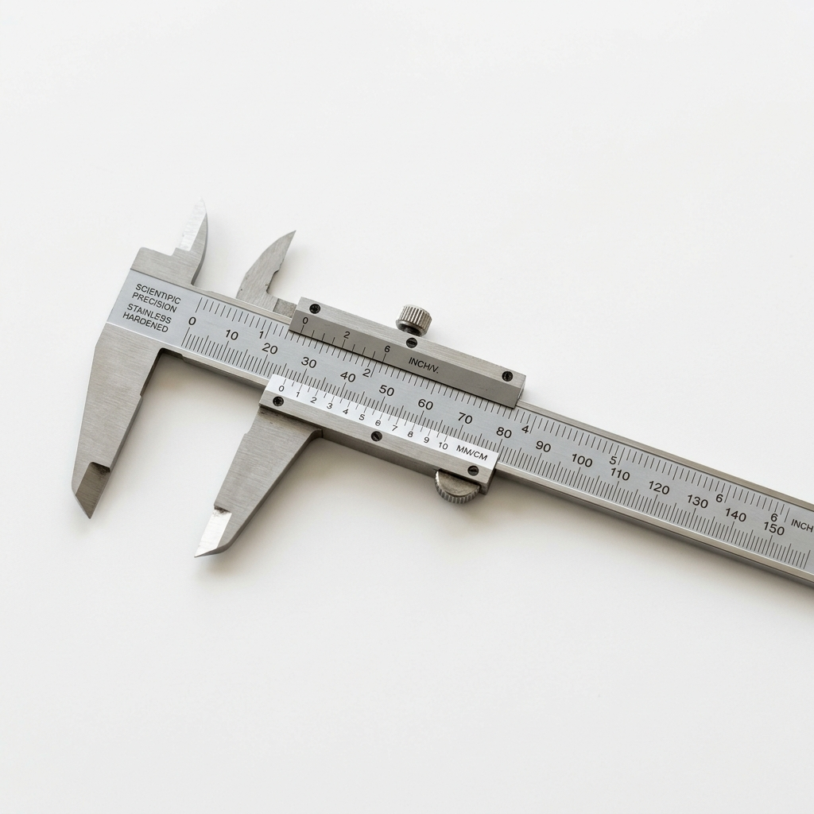
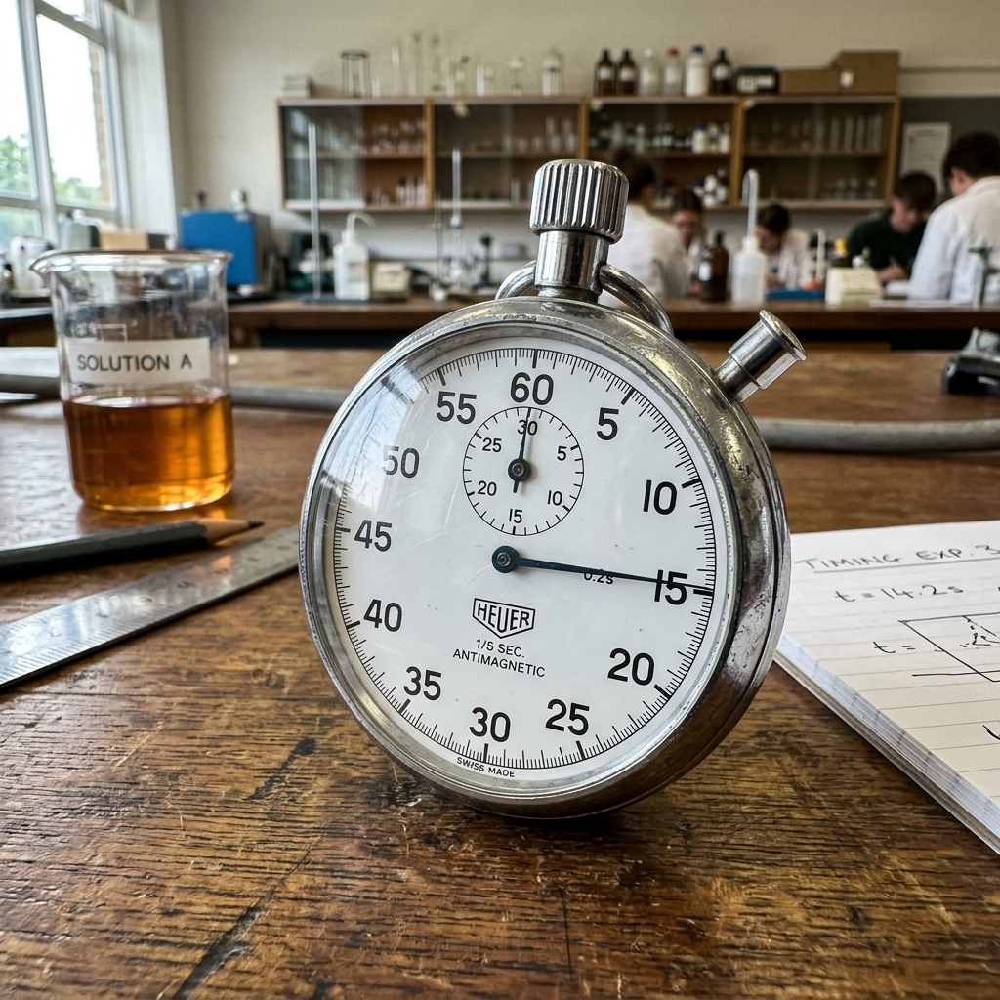
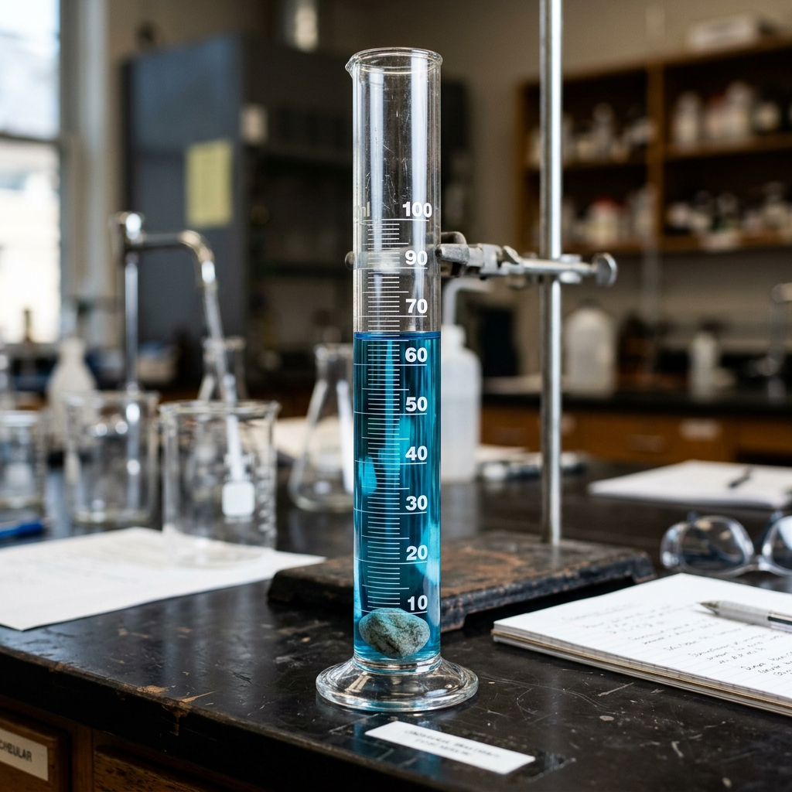

# Evaluasi Akhir Bab 1: Besaran dan Pengukuran

## A. Pilihan Ganda
*Pilihlah satu jawaban yang paling tepat!*

1. **Stimulus 1:** Perhatikan tabel besaran pokok dan satuannya berikut ini.
   | No | Besaran | Satuan (SI) |
   |---|---|---|
   | 1 | Panjang | kilometer |
   | 2 | Massa | kilogram |
   | 3 | Waktu | jam |
   | 4 | Suhu | kelvin |
   
   Berdasarkan tabel di atas, pasangan besaran pokok dan satuan Sistem Internasional (SI) yang benar ditunjukkan oleh nomor...
   A. 1 dan 2
   B. 1 dan 3
   C. 2 dan 4
   D. 3 dan 4

2. **Stimulus 2:** Budi sedang membantu ibunya membuat kue. Ia membutuhkan 500 gram tepung terigu, namun timbangan di rumahnya menggunakan satuan kilogram (kg).
   Berapakah massa tepung terigu tersebut jika dinyatakan dalam Sistem Satuan Internasional (SI)?
   A. 0,05 kg
   B. 0,5 kg
   C. 5 kg
   D. 50 kg

3. **Stimulus 3:** Perhatikan gambar pengukuran menggunakan jangka sorong berikut!
   
   *(Ilustrasi: Pengukuran dengan jangka sorong)*
   Jangka sorong memiliki dua skala, yaitu skala utama dan skala nonius. Ketelitian alat ukur ini umumnya adalah 0,1 mm atau 0,01 cm. Salah satu fungsi utama jangka sorong adalah...
   A. Mengukur massa suatu benda yang sangat ringan
   B. Mengukur diameter dalam dan luar sebuah pipa
   C. Mengukur ketebalan sehelai kertas
   D. Mengukur kedalaman laut

4. **Stimulus 4:** Sebuah balok kayu memiliki panjang 10 cm, lebar 5 cm, dan tinggi 2 cm. Volume balok merupakan besaran turunan.
   Besaran turunan volume diturunkan dari besaran pokok...
   A. Massa
   B. Waktu
   C. Panjang
   D. Suhu

5. **Stimulus 5:** Neraca Ohaus digunakan untuk mengukur massa suatu benda. Terdapat tiga lengan pada neraca Ohaus, masing-masing dengan skala ratusan, puluhan, dan satuan gram.
   Jika lengan ratusan menunjuk angka 200, lengan puluhan menunjuk angka 40, dan lengan satuan menunjuk angka 5,5. Maka hasil pengukurannya adalah...
   A. 200,455 gram
   B. 240,5 gram
   C. 245,5 gram
   D. 295 gram

## B. Pilihan Ganda Kompleks
*Pilihlah lebih dari satu jawaban yang benar (bisa 2 atau 3 jawaban benar)!*

6. **Stimulus 6:** Besaran dibedakan menjadi dua, yaitu besaran pokok dan besaran turunan. Besaran turunan diturunkan dari besaran pokok.
   Di bawah ini, manakah yang termasuk ke dalam besaran turunan?
   [ ] A. Luas
   [ ] B. Massa
   [ ] C. Kecepatan
   [ ] D. Kuat arus listrik

7. **Stimulus 7:** Syarat sebuah satuan agar dapat ditetapkan sebagai Satuan Internasional (SI) yang baik haruslah memenuhi beberapa kriteria.
   Manakah dari pernyataan berikut yang merupakan syarat Satuan Internasional?
   [ ] A. Bersifat tetap, tidak mengalami perubahan oleh pengaruh apapun.
   [ ] B. Hanya berlaku di satu negara saja.
   [ ] C. Mudah ditiru bagi siapa saja yang akan menggunakannya.
   [ ] D. Berlaku secara internasional di mana pun.

8. **Stimulus 8:** Dalam praktikum fisika, Andi diberikan beberapa alat ukur untuk mengukur dimensi benda.
   Alat ukur manakah yang cocok digunakan untuk mengukur dimensi sebuah balok logam kecil dengan presisi tinggi (ketelitian hingga 0,1 mm atau lebih kecil)?
   [ ] A. Mistar / Penggaris
   [ ] B. Jangka Sorong
   [ ] C. Mikrometer Sekrup
   [ ] D. Gelas Ukur

9. **Stimulus 9:** Konversi satuan sangat penting dalam perhitungan sains.
   Pernyataan konversi satuan berikut ini yang tepat adalah...
   [ ] A. 1 kilometer = 1.000 meter
   [ ] B. 1 ton = 100 kilogram
   [ ] C. 1 jam = 3.600 sekon
   [ ] D. 1 kilogram = 1.000 gram

10. **Stimulus 10:** Untuk mengukur volume batu yang bentuknya tidak beraturan, siswa menggunakan gelas ukur yang berisi air.
    Pernyataan yang tepat mengenai metode pengukuran ini adalah...
    [ ] A. Metode ini disebut sebagai metode perpindahan (selisih cairan).
    [ ] B. Volume batu sama dengan volume awal air dikurangi volume akhir air.
    [ ] C. Volume batu sama dengan volume air yang naik (V akhir - V awal).
    [ ] D. Gelas ukur dapat digunakan untuk mengukur massa jenis air secara langsung.

## C. Benar atau Salah
*Tentukan apakah pernyataan berikut Benar (B) atau Salah (S)!*

11. **Stimulus 11:** Jarak rumah Siti ke sekolah adalah 1,5 kilometer. Angka 1,5 menunjukkan besaran, sedangkan kilometer menunjukkan satuan.
    ( Benar / Salah )

12. **Stimulus 12:** Massa jenis merupakan besaran turunan yang diturunkan dari besaran pokok massa dan panjang.
    ( Benar / Salah )

13. **Stimulus 13:** Ketelitian mikrometer sekrup adalah 0,01 mm, sehingga alat ini lebih teliti dibandingkan dengan jangka sorong yang memiliki ketelitian 0,1 mm.
    ( Benar / Salah )

14. **Stimulus 14:** Jengkal tangan dan hasta merupakan contoh satuan tidak baku, karena hasil pengukurannya bisa berbeda-beda antara satu orang dengan orang lainnya.
    ( Benar / Salah )

15. **Stimulus 15:** 
    Pada alat ukur stopwatch analog, lingkaran yang berukuran lebih kecil berfungsi untuk menunjukkan hitungan menit.
    ( Benar / Salah )

## D. Menjodohkan
*Jodohkanlah pernyataan pada kolom A dengan jawaban yang tepat pada kolom B!*

**Kolom A (Pernyataan)**
16. Alat ukur yang paling tepat digunakan untuk mengukur ketebalan selembar kertas. ( ... )
17. Besaran pokok yang memiliki satuan Sistem Internasional (SI) berupa sekon. ( ... )
18. Alat ukur yang umum digunakan untuk menentukan massa suatu zat secara presisi di laboratorium. ( ... )
19. Besaran turunan yang memiliki satuan kg/m³. ( ... )
20. Hasil konversi dari 2,5 meter ke dalam besaran sentimeter (cm). ( ... )

**Kolom B (Pilihan Jawaban)**
A. Waktu
B. Neraca Ohaus
C. Mikrometer Sekrup
D. 250 cm
E. Massa Jenis
F. 25 cm
G. Jangka Sorong

## E. Isian Singkat
*Isilah titik-titik di bawah ini dengan jawaban yang singkat dan tepat!*

21. Segala sesuatu yang dapat diukur dan dapat dinyatakan dengan angka serta diikuti oleh satuan disebut sebagai ....

22. **Stimulus 16:** 
    Sebuah gelas ukur mula-mula berisi air dengan volume awal 150 mL. Setelah sebuah benda padat tak beraturan dimasukkan ke dalamnya secara tenggelam, volume air naik menunjuk skala 200 mL. Berdasarkan metode perpindahan air, volume benda padat tersebut adalah .... mL.

23. Satuan suhu yang ditetapkan sebagai standar dalam Sistem Internasional (SI) bukanlah derajat Celcius, melainkan ....

24. Jika massa sebuah kubus adalah 100 kg dan volumenya terukur sebesar 2 m³, maka massa jenis dari material kubus tersebut adalah .... kg/m³.

25. Berdasarkan konversi satuan waktu, 1 hari sama dengan 24 jam. Jika dinyatakan ke dalam satuan Sistem Internasional, maka 1 hari setara dengan .... sekon.

---

### Kunci Jawaban Singkat (Untuk Guru)
**A. Pilihan Ganda**
1. C (2 dan 4)
2. B (0,5 kg)
3. B (Mengukur diameter dalam dan luar sebuah pipa)
4. C (Panjang)
5. C (245,5 gram)

**B. Pilihan Ganda Kompleks**
6. A (Luas), C (Kecepatan)
7. A, C, D
8. B (Jangka Sorong), C (Mikrometer Sekrup)
9. A, C, D
10. A, C

**C. Benar atau Salah**
11. Salah (1,5 menunjukkan nilai ukur/angka, kilometer menunjukkan satuan)
12. Benar (Massa jenis = massa/volume. Volume diturunkan dari panjang x panjang x panjang)
13. Benar
14. Benar
15. Benar

**D. Menjodohkan**
16. C (Mikrometer Sekrup)
17. A (Waktu)
18. B (Neraca Ohaus)
19. E (Massa Jenis)
20. D (250 cm)

**E. Isian Singkat**
21. Besaran
22. 50
23. Kelvin
24. 50
25. 86.400
